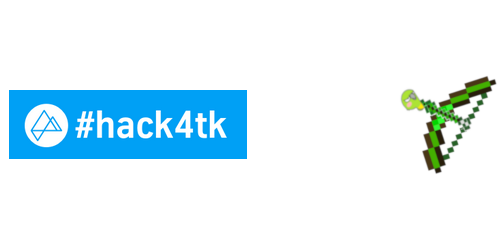

# 3.Hack4tk
 
The private team workspace for the preparation and solution of the 3. Hackathon Thyssenkrupp

How to:

the 0.5 version is the original demo, which we build the rough demo during the 3.Hack4tk competetion between 12:00 10.07.2018 and 11:00 11.07.2018

the demo is used to show you how to detect the state and count the amount of coils in the work places. the recently functions are 

1. distinguish the single coil from the coil stack
2. count the amount of all the single coils

an example illustrate as follows:

 
 
 
 
 

